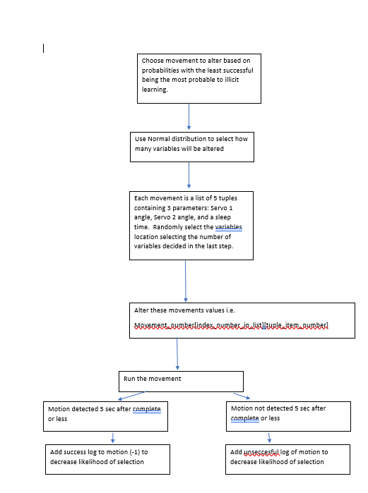

# Cat_Laser

**Project Title:** 

**Project Overview:**  A Project to create a two dementional laser pointer articulated by two servos.  The laser has movements that through motion detection and supervised learning the laser creats the best five point movement to engage the cat. This uses reinforment learning training servo motors to find the optimal movement

**Methodology:**
* 
*	
**Results and Outcomes:**

Markdown

**Challenges and Lessons Learned:**

**Additional Information:**
*
Keywords:

